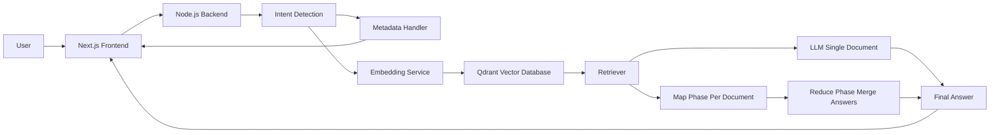

# Neural Search Engine  
### Production-Ready Multi-Document RAG with Map-Reduce Architecture

Neural Search Engine is a full-stack, enterprise-grade Retrieval-Augmented Generation (RAG) system designed for accurate, safe, and explainable document intelligence. It supports strict document scoping, deterministic intent detection, and multi-document reasoning using a hard-enforced Map-Reduce RAG pipeline.

This system is intentionally conservative: it answers **only when information is explicitly present in documents** and returns a clear fallback otherwise.

---

## 🚀 Core Features

• Semantic document search using dense embeddings  
• Vector storage and retrieval via Qdrant  
• Current Document and All Documents query modes  
• Hard-enforced Map-Reduce RAG for multi-document queries  
• Deterministic intent detection (metadata vs content)  
• Hallucination-resistant answer generation  
• File deduplication and ingestion locking  
• ChatGPT-style UI with persistent chat history  

---

## 🧠 System Architecture

### High-Level Architecture Diagram



## Query Modes

### Current Document Mode
• Query is scoped to a single selected document  
• Prevents cross-document leakage  
• Requires an explicitly selected document  

### All Documents Mode
• Searches across all uploaded documents  
• Ensures balanced retrieval per document  
• Uses Map-Reduce RAG when multiple documents exist  


neural_search_engine/
├── backend/            # API, RAG logic, intent routing
├── frontend-next/      # Primary Next.js frontend
├── ingestion/          # Python ingestion pipeline
├── infra/              # Docker & infrastructure configs
├── docs/               # Documentation assets
├── README.md
└── .gitignore

---

## Tech Stack

Backend  
• Node.js + TypeScript  
• Express  
• Qdrant Vector Database  
• LLM API (pluggable)  

Frontend  
• Next.js 14 (App Router)  
• TypeScript  
• Tailwind CSS  

Ingestion  
• Python  
• PDF/Text loaders  
• Chunking with overlap  
• Vector upserts to Qdrant  

---

## Safety & Correctness Guarantees

✔ Answers only when information exists in documents  
✔ Explicit “not found” responses when missing  
✔ No hallucinated summaries  
✔ No silent assumptions  
✔ Deterministic behavior for identical queries  
✔ Safe handling of ambiguous prompts  

---

## Local Setup Instructions

### 1. Clone the Repository
```bash
git clone https://github.com/poornachandran2006/Neural_Search_Engine.git
cd Neural_Search_Engine

2. Start Qdrant (Docker Required)
docker run -p 6333:6333 qdrant/qdrant

3. Backend Setup
cd backend
npm install
npm run dev

4. Ingestion Pipeline
cd ingestion
python src/main.py --file path/to/your/document.pdf

5. Frontend Setup
cd frontend-next
npm install
npm run dev


Open the application at:

http://localhost:3000

Environment Variables
Backend (backend/.env)
OPENAI_API_KEY=your_api_key
QDRANT_URL=http://localhost:6333

Frontend (frontend-next/.env.local)
NEXT_PUBLIC_API_BASE_URL=http://localhost:5000

Verified Behavior

• Current Document queries only use selected document
• All Documents queries correctly merge information
• Map-Reduce activates only when required
• Metadata queries bypass embeddings and LLM
• Resume and policy documents behave independently
• Queries like “compare”, “summarize”, and “list documents” work deterministically

Why This Project Matters

This system demonstrates real-world RAG engineering:
• Multi-document reasoning
• Controlled LLM usage
• Safe retrieval pipelines
• End-to-end system design


